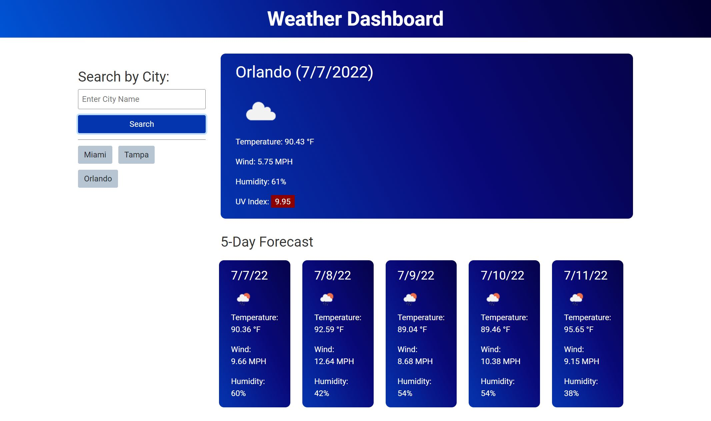
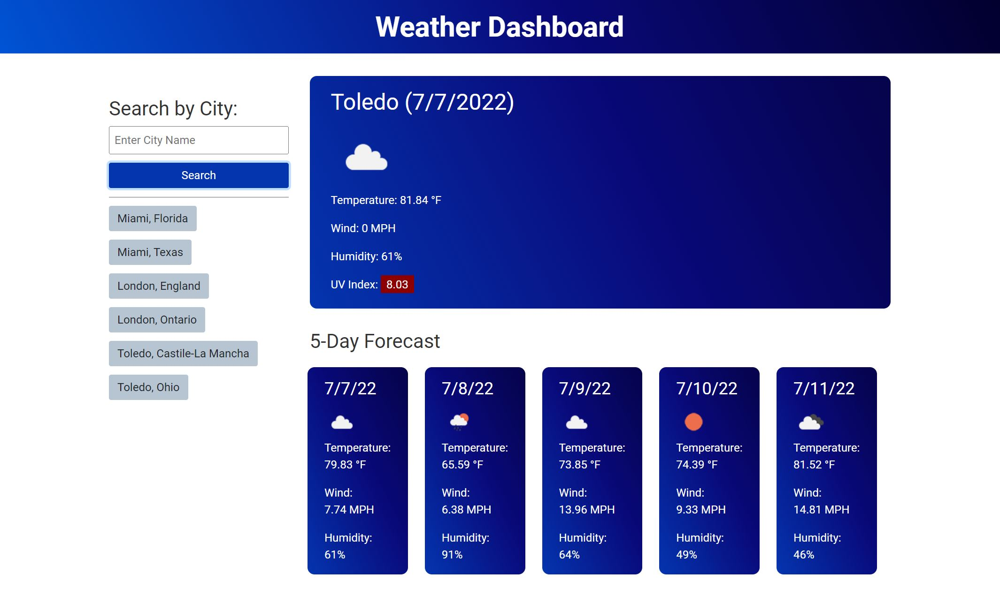

# Weather Dashboard

*dashboard screenshot showing the weather in Orlando, FL*

## About

I was asked to build a webpage for planning trips that would allow users to search for a city name and see the current weather conditions along with a five-day forecast. The page utilizes the OpenWeather One Call API to select the correct city and request weather data. In addition to displaying the weather, the page saves each search term in local storage to let the user quickly retrieve data for cities they've recently searched. The page is also responsive for mobile devices.

### Disambiguation

One shortcoming of the initial development was that a search term like "London" would always return weather in London, England rather than London, Ontario, Canada. For most users, this would be fine, but I wanted a way to disambiguate search terms. To do so, I made the dashboard display the state and country info for up to 10 cities with shared names in a prompt windwo and allowed the user to choose from the list. If two cities with the same name appear in the list of recent search terms at the same time, their state/country will be automatically displayed to avoid confusion.

*recent searches of Miami, London, and Toledo disambiguated*

### Testing and Usage

The API requests involved in the dashboard require an API key issued by OpenWeather. The Javascript references a variable "apiKey", which is set to "config.API_KEY". The file with that object is not in the GitHub repo.

## Contact

Brett Piper - <bpiper91@gmail.com>

Deployed project: <https://bpiper91.github.io/weather-dashboard>

GitHub repo: <https://github.com/bpiper91/weather-dashboard>